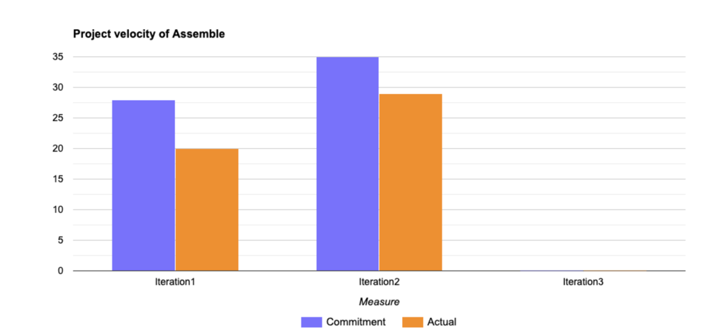

**Retro**:

## What went well in Iteration2
Several aspects of our development process went well. The integration of various functionalities into a single app worked smoothly, providing a cohesive user experience. The team effectively managed tasks and deadlines, leading to the successful completion of the iteration. The database integration was successful, and we were able to use HSQLDB smoothly. The profile management and logout features were enhanced based on iterative feedback.

Additionally, the UI components were well-designed and interactive, thanks to the focused efforts on front-end development. We have completed the implementation of the basic functionality of all the base features. And moved the low-priority features that had not been implemented to the next iteration. This shows that our team is active in developing new features and has good control and planning ability for the project's progress.

## What did not go well in Iteration2 & how to improve
During our iteration 2 retrospective, we identified the need for better coordination and documentation. Implementing a clear documentation process and architecture greatly improved our workflow. However, we realized that we should have integrated these practices from the start. We also had issues with the unit tests in the 2nd iteration but added sufficient tests throughout the code in the next iteration. The documentation helped us keep track of our progress and made it easier to onboard new members and maintain the project.

1.  **Enhanced coordination and documentation**：

    -   Implement regular team meetings and reviews to ensure that all members have a clear understanding and are up-to-date on the project's documentation requirements.

    -   Create and maintain a centralized document repository that includes all of the project's documents, as well as records of updates and modifications.

2.  **Intensive Unit Testing**：
    -   Developed and executed a comprehensive unit testing program covering all new code and critical functionality.

    -  Introduced a code review process to ensure that all new code commits pass rigorous testing prior to merging.

3. **Successful assessment methods**：
    - Documentation Completeness and Accessibility**: Evaluate documentation completeness and ease of use through weekly internal reviews and team feedback to achieve an internal satisfaction rate of 80% or higher.

    - Code Coverage**: track unit test coverage using Android Studio's built-in tools with the goal of achieving at least 80% coverage.

    - Project Delivery Time**: Measure the efficiency of project management by comparing the scheduled iteration end time to the actual completion time. Aim for an error of less than 30% from the previous iteration=

## Project velocity:
In each of the last two iterations, the actual rate of completion of the project (orange columns) was lower than we expected (blue columns). Although the number of tasks actually completed increased in the second iteration, we still fell short of our expectations. This suggests that while the efficiency of project execution has improved, planning still needs to be more realistic and precise. We need to continue to improve the planning and resource allocation of tasks to ensure that actual execution is closer to or exceeds the expected goals. The effect of this improvement will be assessed by comparing the actual and expected rate of completion in the next iteration.
